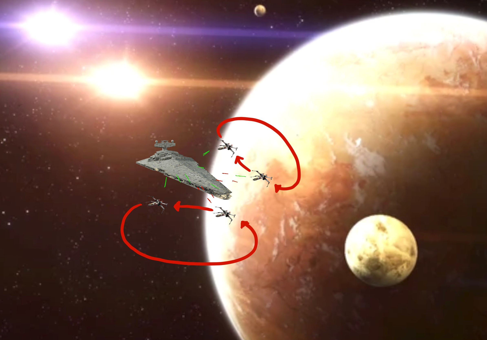

# StarWars_WebGL

Recreación de una batalla espacial con un Star Destroyer en el centro y X-Wings atacando mientras dan vueltas alrededor de la nave.

Esta batalla tiene como localización las afueras de la atmósfera de Tatooine con sus icónicos dos soles y las estrellas de fondo.

### Integrantes del equipo

- César Arturo Martínez Valenzuela A00517067
- Alex Jesús Vargas Castro A00824525

### Recursos:

- Imágenes del Skybox generadas via: 
    
    http://wwwtyro.github.io/space-3d/#animationSpeed=2.049970070436972&fov=83.47092732446109&nebulae=false&pointStars=true&resolution=2048&seed=411fg89l5jm0&stars=true&sun=false

    A procedural 3D generator of space scenes using WebGL created by wwwtyro: https://github.com/wwwtyro & tomahim: https://github.com/tomahim

- [Modelo del Imperial Star Destroyer](https://sketchfab.com/3d-models/star-wars-imperial-ii-star-destroyer-b8bd2d35f7604670ab85242c06c6d280)
- [Modelo del planeta Tatooine](https://sketchfab.com/3d-models/tatooine-b871789cd77a4e2ab9a9a06de41b67ea)
- [Modelo del X-WING](https://sketchfab.com/3d-models/star-wars-x-wing-fighter-703493e197e445ec9bce1ae00eb7c13c)
- [Model del TIE fighter](https://sketchfab.com/3d-models/3d-tie-fighter-star-wars-model-5375de94c2484ab0b2a2bd75aa63c2b4)
- [Modelo del sol](https://sketchfab.com/3d-models/sun-9ef1c68fbb944147bcfcc891d3912645#download)
- [Modelo de la flota rebelde](https://sketchfab.com/3d-models/resistance-fleet-resistance-navy-e931fe8cff1540f7bbd3b191c5e8eb27)
